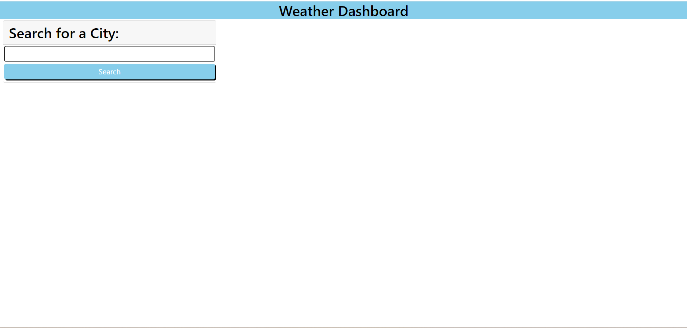
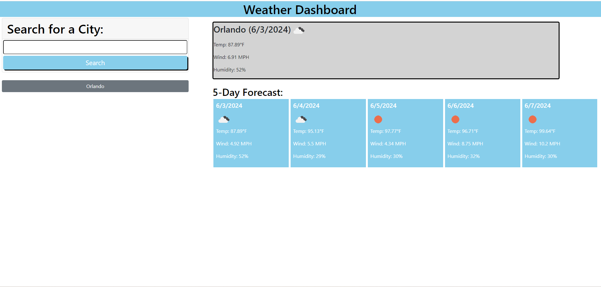
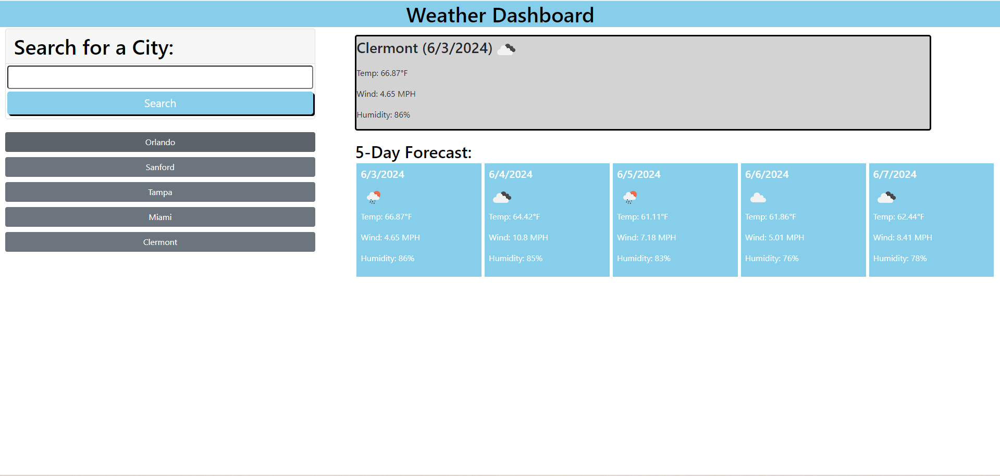
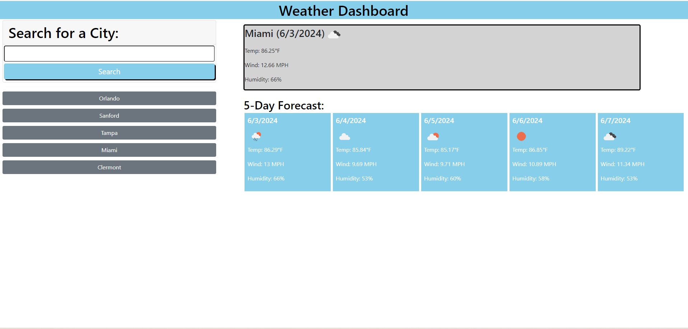

# weather-forecast-app

## Description
Weather Forecast Application provides the current weather and forecast information for next 5 days. The Application allows you to search for weather information based on city and leverages open weather API to get geographical coorodinates for the city. The geographical coordinates will be used and fed to Open Weather APIs to accurately find current and forecast weather information.

The application also displays the cities the user searched for weather information within the scope of user browser session.

## Screenshots

## Link to Deployed Site

https://pranithgunda.github.io/weather-forecast-app/